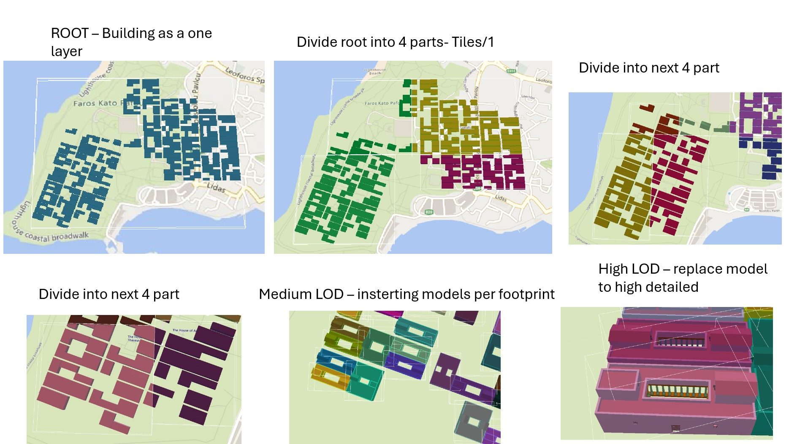

# Procedural Models in Cesium

# Skrypty do wizualizacji modeli 3D powstałych w wyniku modelowania proceduralnego

Skrypty tworzące pliki konfiguracyjne `tileset.json` określajace sposób wizualizacji modeli 3D na róznych poziomach szczegółowości:

- `scripts/main_create_buildings_tileset.py` - kafelkowanie najniższego poziomu LOW LOD, zmapowanie modeli per budynek mieszkalny na poziomach Medium oraz Hight

- `scripts/main_create_agora_tileset.py` - trzy poziomy szczegółowości generowania modeli 3D budynków tworzących agorę

- `scripts/main_create_citywall_tileset.py` - zmapowanie modeli 3D muru miejskiego

- `scripts/main_create_roads_tileset.py` - zmapowanie modeli 3D dróg

- `scripts/main_create_molo_tileset.py` - zmapowanie modeli 3D mola

 

## Skrypt do tworzenia konfiguracji dla budynków miejskich
`main_create_buildings_tileset.py`

 

Skrypt przyjmuje model ROOT jako jeden model skłądający się z wszystkich budynków. Następnie kafeluje ten model trzykrotnie - za każdym razem dzieli model na cztery części. Na końcu dodawane są modele pojedynczych budynków na poziomie Medium, a nastęnie na poziomie High.

 

W skrypcie należy zdefiniować:
-  `TILESET_DIR = "./test/tilesets/homes/"`
    (ścieżka do nadrzędnego folderu tilesetu)
- `ROOT_URI = "tiles/0/LOD0_0.glb"` (ścieżka do modelu root, który będzie później kafelkowany przez skrypt)
- `TRANSFORM = [...]` (macierz transformacji 4x4 do ustawienia lokalizacji i orientacji tilesetu)

*Istotne jest, aby właściwie w odpowiedniej strukturze umieścić model ROOT (tiles/0) oraz poziomy LOD Medium (tiles/4) oraz High (tiles/5). Modele per budynek na poziomie Medium oraz High powinny mieć takie same nazwy.*

Wynikiem skryptu jest plik `tileset.json` definiujący hierarchie modeli. Jest on generowany w folderze tilesetu - `TILESET_DIR`.


```
tileset_name/ (TILESET_DIR)
├── tiles/
│   ├── 0
│        ── LOD0_0.glb
│   ├── 1
│        ── (kafelkowane modele generowane przez skrypt)
│   └── 2
│        ── (kafelkowane modele generowane przez skrypt)
│   └── 3
│        ── (kafelkowane modele generowane przez skrypt)
│   └── 4 (model per budynek)
│        ── LOD_Block_1_8.glb
│        ── LOD_Block_1_9.glb
│        ── ...
│   └── 5 (model per budynek)
│        ── LOD_Block_1_8.glb
│        ── LOD_Block_1_9.glb
│        ── ...
└── tileset.json (wynikowy plik generowany przez skrypt)
```

## Skrypt do tworzenia konfiguracji dla budynków Agory
`main_create_agora_tileset.py`

 

Analogicznie jak w przypadku budynków mieszkalnych należy zdefiniować:
-  `TILESET_DIR = "./test/tilesets/agora/"`
    (ścieżka do nadrzędnego folderu tilesetu)
- `ROOT_URI = "tiles/0/agora_0.glb"` (ścieżka do modelu root - poziom LOW LOD)
- `TRANSFORM = [...]` (macierz transformacji 4x4 do ustawienia lokalizacji i orientacji tilesetu)

*Istotne jest, aby w odpowiedniej strukturze umieścić modele na poziomach LOD Low (tiles/0), Medium (tiles/1) oraz High (tiles/2)*

```
tileset_name/ (TILESET_DIR)
├── tiles/
│   ├── 0
│        ── agora_0.glb
│   └── 1 (model per budynek)
│        ── agora_Shape_0.glb
│        ── agora_Shape_1.glb
│        ── ...
│   └── 2 (model per budynek)
│        ── agora_Shape_0.glb
│        ── agora_Shape_1.glb
│        ── ...
└── tileset.json (wynikowy plik generowany przez skrypt)
```

## Skrypty do tworzenia konfiguracji dla murów miejskich, dróg, mola
`main_create_citywall_tileset.py`
`main_create_roads_tileset.py`
`main_create_molo_tileset.py`

Analogicznie jak w przypadku wcześniejszych skryptów należy zdefiniować:
-  `TILESET_DIR = "./test/tilesets/citywall/"`
    (ścieżka do nadrzędnego folderu tilesetu)
- `ROOT_URI = "tiles/0/mury_0.glb"` (ścieżka do modelu root)
- `TRANSFORM = [...]` (macierz transformacji 4x4 do ustawienia lokalizacji i orientacji tilesetu)

*Istotne jest, aby w odpowiedniej strukturze umieścić model na poziomie LOD Low (tiles/0)*

```
tileset_name/ (TILESET_DIR)
├── tiles/
│   ├── 0
│        ── mury_0.glb
└── tileset.json (wynikowy plik generowany przez skrypt)
```

Powyższy przykład dla muru jest analogiczny dla dróg oraz mola.


## Uruchomienie skryptów
### Docker oraz Blender Python API
Projekt wykorzystuje środowisko Docker z preinstalowanym Blenderem, którego Python API jest wykorzystywane do analizy modeli 3D (np. wyznaczanie Bbox'ów modeli) oraz przetwarzania modeli 3D (podział modelu na mniejsze części - kafelkowanie).

Opracowane skrypty Pythona wykorzystujące API Blendera uruchamiane są bezpośrednio w środku kontenera, z użyciem poniższej komendy:

`blender --background --python ./scripts/main_create_buildings_tileset.py`

Zalecane jest uruchamianie projektu w devcontainerze (np. z poziomu Visual Studio Code) opartym o dostarczony **Dockerfile**, ponieważ:
- Docker zapewnia powtarzalne środowisko z odpowiednią wersją Blendera
- Devcontainer pozwala wygodnie podłączać lokalne pliki i wolumeny (volumes), co ma kluczowe znaczenie przy przygotowywaniu danych wejściowych (modeli 3D na różnych poziomach szczegółowości LOD)
- Umożliwia pracę bezpośrednio wewnątrz kontenera z pełnym dostępem do terminala, Blendera i kodu źródłowego
>>>>>>> 15fcdb8 (init)
