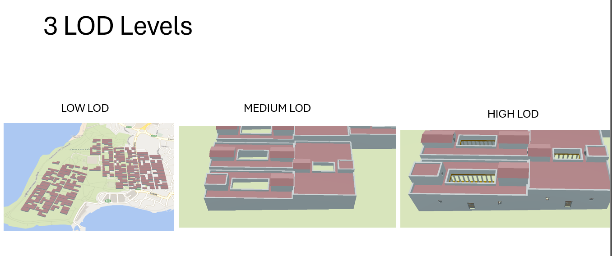

# Procedural Models in Cesium
## Scripts for visualizing 3D models generated through procedural modeling.

This repository includes Python scripts that generate tileset.json configuration files defining how 3D models are visualized at various Levels of Detail (LODs) in Cesium.


## Overview of Scripts
- `scripts/main_create_buildings_tileset.py` - Tiles the base LOW LOD model and maps per-building models at Medium and High LODs.

- `scripts/main_create_agora_tileset.py` - Generates three LODs for the agora buildings.

- `scripts/main_create_citywall_tileset.py` - Maps 3D models of the city wall.

- `scripts/main_create_roads_tileset.py` - Maps 3D models of the roads.

- `scripts/main_create_molo_tileset.py` - Maps 3D models of the pier.

 

## Creating a Tileset for Residential Buildings
`main_create_buildings_tileset.py`
This script takes a single ROOT model (containing all buildings), and tiles it three times by splitting it into four parts at each level. Finally, it adds individual building models for Medium and High LODs.

 

 

Required definitions in the script:
-  `TILESET_DIR = "./test/tilesets/homes/"` - Path to the root directory of the tileset.
    
- `ROOT_URI = "tiles/0/LOD0_0.glb"` - Path to the ROOT model to be tiled.
- `TRANSFORM = [...]` - 4x4 transformation matrix defining the tileset's position and orientation.

**Important:**
- Ensure the following folder structure is respected:

- The ROOT model should be placed under tiles/0/.

- Medium and High LOD models per building should be placed in tiles/4/ and tiles/5/, respectively.

- Medium and High LOD models must use the same filenames for proper matching.

The script generates a `tileset.json` file that defines the model hierarchy. It is created in the tileset directory specified by `TILESET_DIR`.


```
tileset_name/ (TILESET_DIR)
├── tiles/
│   ├── 0
│        ── LOD0_0.glb
│   ├── 1
│   
│   └── 2
│        ── (tiled versions auto-generated by the script)
│   └── 4 (Medium LOD per-building models)
│        ── LOD_Block_1_8.glb
│        ── LOD_Block_1_9.glb
│        ── ...
│   └── 5 (High LOD per-building models)
│        ── LOD_Block_1_8.glb
│        ── LOD_Block_1_9.glb
│        ── ...
└── tileset.json (generated by the script)
```

## Creating a Tileset for Agora Buildings
`main_create_agora_tileset.py`

 

Required definitions in the script:
-  `TILESET_DIR = "./test/tilesets/agora/"`
- `ROOT_URI = "tiles/0/agora_0.glb"` - LOW LOD model
- `TRANSFORM = [...]` 

*It is important to place the models at the Low (tiles/0), Medium (tiles/1), and High (tiles/2) LOD levels in the correct folder structure.*

```
tileset_name/ (TILESET_DIR)
├── tiles/
│   ├── 0
│        ── agora_0.glb
│   └── 1 (Medium LOD)
│        ── agora_Shape_0.glb
│        ── agora_Shape_1.glb
│        ── ...
│   └── 2 (High LOD)
│        ── agora_Shape_0.glb
│        ── agora_Shape_1.glb
│        ── ...
└── tileset.json (output file generated by script)
```

## Creating Tilesets for City Walls, Roads, and Pier
`main_create_citywall_tileset.py`
`main_create_roads_tileset.py`
`main_create_molo_tileset.py`

Each script requires defining:
-  `TILESET_DIR = "./test/tilesets/citywall/"`
    (path to content folder of tileset)
- `ROOT_URI = "tiles/0/mury_0.glb"` (path to root model)
- `TRANSFORM = [...]` (4x4 matrix for tileset placement)

*It is important to place the model at the Low LOD level (tiles/0) in the correct folder structure.*

**Folder structure example (same for roads and pier):**
```
tileset_name/ (TILESET_DIR)
├── tiles/
│   ├── 0
│        ── mury_0.glb
└── tileset.json (output file generated by script)
```


## Running the Scripts
### Using Docker oraz Blender Python API
This project uses a Docker environment with Blender pre-installed. Blender's Python API is used for operations like calculating bounding boxes and splitting large models into tiles.

**To run a script inside the Docker container:**

`blender --background --python ./scripts/main_create_buildings_tileset.py`


**Recommended: Use Dev Containers (e.g., in Visual Studio Code)**
Why use a dev container?
- Docker ensures a consistent Blender environment.
- Dev containers simplify file sharing between host and container.
- Full terminal access to Blender and source code within the container.

## License
This project is licensed under the Creative Commons Attribution-NonCommercial (CC BY-NC) license.
This means you are free to use, share, and modify the code as long as you give appropriate credit and do not use it for commercial purposes.

Full license details: [CC BY-NC 4.0](https://creativecommons.org/licenses/by-nc/4.0/)